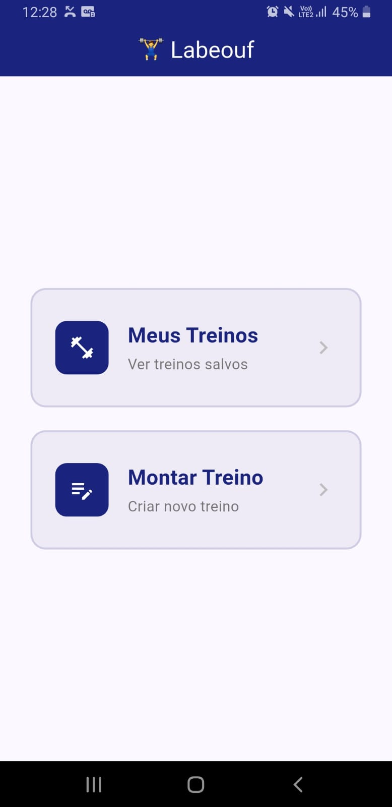
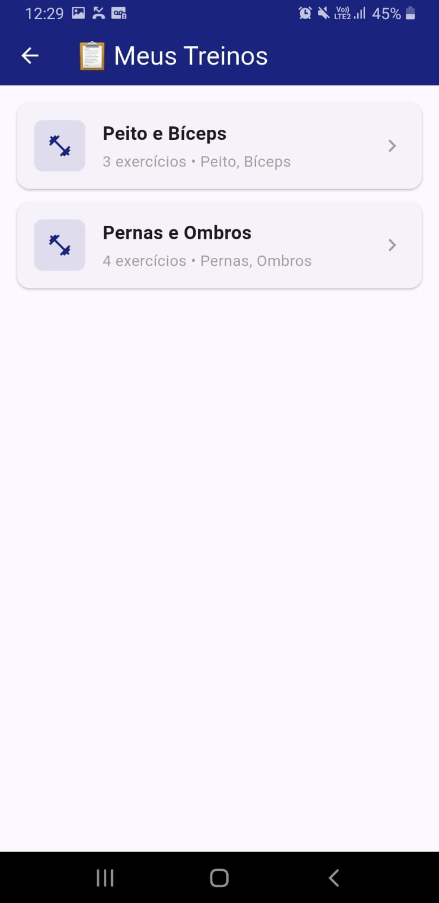
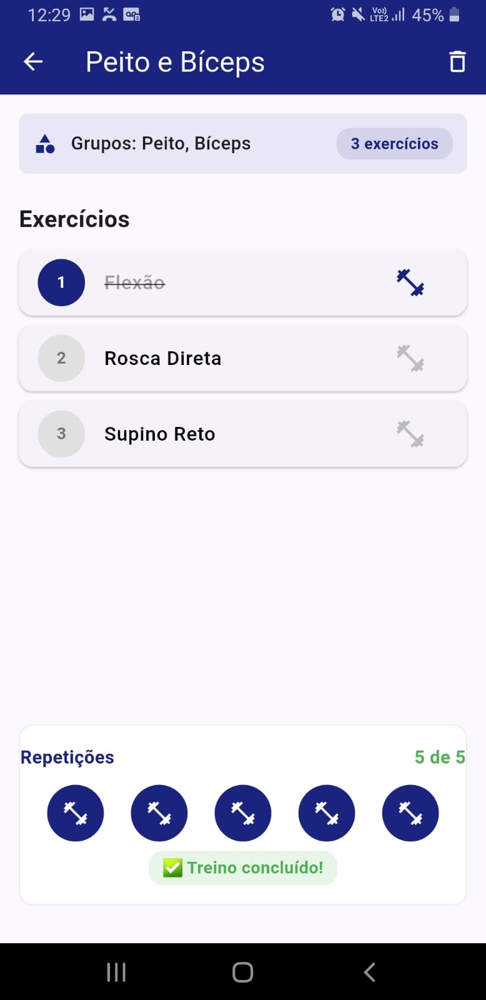
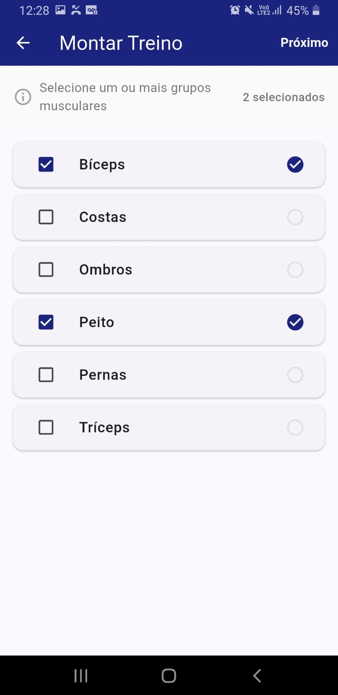
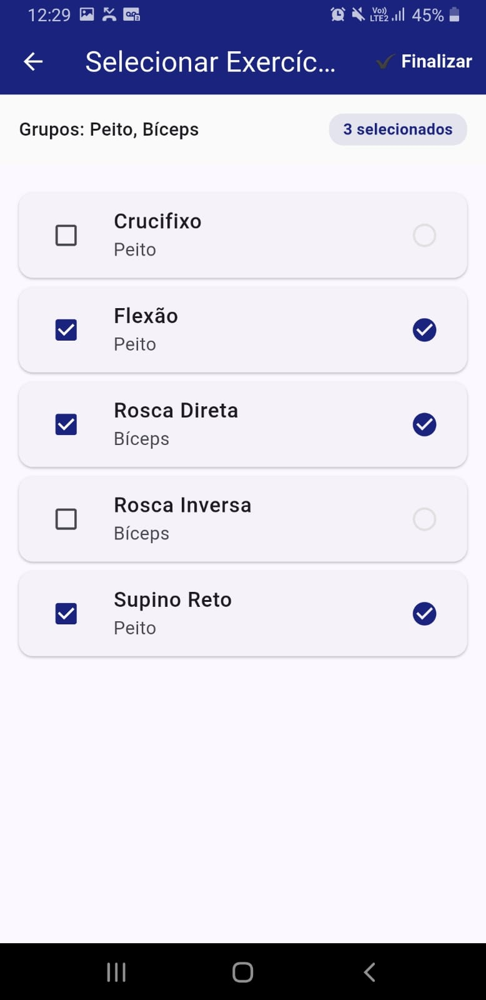

# 🏋️ Labeouf

> App pessoal para montagem e acompanhamento de treinos de musculação


---

## 📱 Sobre o App

O **Labeouf** é um aplicativo minimalista para criação e acompanhamento de treinos de musculação. Com uma interface simples e intuitiva, você pode montar seus treinos selecionando grupos musculares e exercícios, e acompanhar o progresso durante a execução.

### ✨ Funcionalidades

- **Criar treinos** selecionando grupos musculares e exercícios
- **Listar treinos** salvos no banco de dados local
- **Acompanhar execução** marcando exercícios como feitos
- **Controle de repetições** com 5 halteres interativos
- **Excluir treinos** com confirmação

---

## 📸 Telas do App

### Tela Inicial
| Seleção de Grupos | Seleção de Exercícios | Seleção de Exercícios |
|-------------------|----------------------|----------------------|
 |  |  |

### Montar Treino
| Seleção de Grupos | Seleção de Exercícios |
|-------------------|----------------------|
|  |  |

---

## 🛠️ Tecnologias Utilizadas

| Tecnologia | Finalidade |
|------------|------------|
| **Flutter** | Framework multiplataforma |
| **Dart** | Linguagem de programação |
| **SQLite (sqflite)** | Banco de dados local |
| **Path Provider** | Gerenciamento de arquivos |

---

## 🚀 Como Executar

### Pré-requisitos
- [Flutter SDK](https://flutter.dev/docs/get-started/install)
- [Android Studio](https://developer.android.com/studio) ou VS Code
- Dispositivo Android/iOS

### Passos

```bash
# 1. Clone o repositório
git clone https://github.com/devlucaspires/labeouf.git

# 2. Entre na pasta
cd labeouf

# 3. Instale as dependências
flutter pub get

# 4. Execute o app
flutter run
```

---

## 🔮 Aprimoramentos Futuros

Ideias para evoluir o app:

### Funcionalidades Planejadas

- [ ] **Adicionar novos exercícios** diretamente pelo app
- [ ] **Criar novos grupos musculares** dinamicamente
- [ ] **Editar treinos existentes** (renomear, adicionar/remover exercícios)
- [ ] **Ordenar treinos** por data de criação ou nome
- [ ] **Cronômetro** para controle de descanso entre séries

---

**Sugestões e contribuições são bem-vindas!** 🏋️